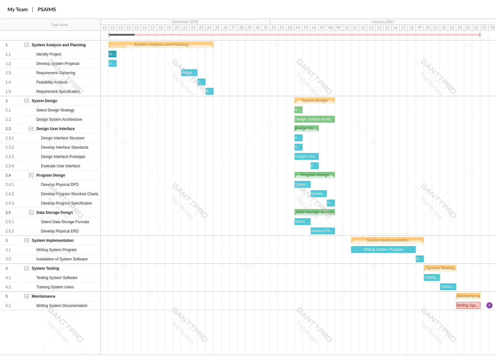

## PROJECT TASKS

**1. System Analysis and Planning**
 - Identify project 
 - Develop [system proposal](../proposal.md)
 - Requirement gathering
 - Analyze technical feasibility
 - Analyze economic feasibility
 - Analyze organization feasibility
 - [Requirements Specifications](https://github.com/mrblack360/PSAIMS/wiki/Functional-Requirements)
 
**2. System Design**
 - Select Design Strategy
 - Design System Architecture
 - Design User Interface
   - Design Interface Structure
   - Develop Interface Standards
   - Design Interface Prototype
   - Evaluate User Interface
 - Program Design 
   - Develop Physical Data Flow Diagram
   - Develop Program Structure Charts
   - Develop Program Specifications
 - Data Storage Design
   - Select Data Storage Formats
   - Develop Physical Entity Relationship Diagram
   
**3. System Implemenation**
 - Writing System Program
 - Installation of System Software
 
**4. System Testing**
 - Testing System Software
 - Training Users
 
 **5. Maintaninance**
  - Writting [System Documentation]()
  
### Task Dependency and Critical Path
The dependency among project tasks as well a s expected time in which PSAIMS projects will be completed is elaborated in the following *gantt chart* below.

